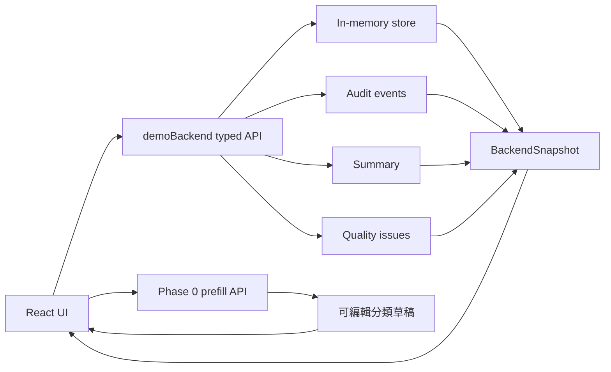

# 前後端系統設計

本文件描述災害資訊整理工作台目前的可發行 demo 架構。系統仍是瀏覽器內執行的 Vite app，但已用 typed backend service 模擬 API、資料儲存、CAPTCHA 驗證、操作紀錄、資料品質佇列與統計摘要。

## 架構目標

- 前端負責角色分流、表單操作、分類工作台、排行榜與資料狀態呈現。
- 後端服務層負責資料新增、留言、接單、完成任務、CAPTCHA challenge、summary 與 audit log。
- 後端服務層會回傳 data quality issues，協助資訊整理者優先處理高風險資料。
- 後端服務層會檢查角色權限；例如資料品質 issue 只能由資訊整理者標記已處理。
- API 預填只產生分類草稿，不負責確認資訊真偽。
- 所有與災害行動相關的畫面都保留「未確認、不能直接出發」的邊界。

## 前端

主要入口：

```text
src/main.tsx
src/app/App.tsx
src/components/LoginPanel.tsx
src/features/phase-0/
```

前端畫面分成兩個角色：

- 回報與行動者：新增未確認資訊、留言、查看原始資訊、接 demo 任務、完成 demo 任務、查看排行榜。
- 資訊整理者：查看整理總覽、原始資訊、排行榜、後端狀態、操作紀錄，並進入整理工作台。

前端不直接修改散落資料，而是呼叫 backend instance 的方法取得下一份 snapshot。每次 `App` render session 會建立自己的 backend instance，避免測試或多次掛載時共用全域狀態。

## 後端服務層

主要檔案：

```text
src/backend/demo-backend.ts
```

後端服務層提供：

- `createDemoBackend()`：建立獨立 backend instance，測試可用乾淨狀態。
- `demoBackend`：保留給簡易引用的 singleton demo backend；正式 `App` 會建立自己的 instance。
- `requestCaptchaChallenge()`：建立 CAPTCHA challenge。
- `login()`：驗證 CAPTCHA 並建立 session user。
- `createRecord()`：新增 `needs_review` 原始資訊。
- `addComment()`：新增留言。
- `acceptTask()`：更新 demo 接單狀態。
- `completeTask()`：更新 demo 完成狀態。
- `reviewQualityIssue()`：標記資料品質 issue 已處理，並寫入 audit log。
- `BackendAuthorizationError`：非授權角色呼叫受限操作時丟出的 domain error。
- `getSnapshot()`：回傳 records、interactions、assignments、summary、audit events、quality issues。

## Snapshot 結構

```text
BackendSnapshot
├─ records
├─ interactions
├─ taskAssignments
├─ summary
├─ auditEvents
└─ qualityIssues
```

`summary` 用於前端狀態板，包含：

- 原始資訊總數
- 待確認資訊數
- 使用者新增資訊數
- 留言數
- 接單中任務數
- 已完成任務數
- 尚有效的 CAPTCHA 數
- 高風險資料品質 issue 數
- 已處理資料品質 issue 數
- 後端拒絕操作數

`auditEvents` 用於近期操作紀錄，包含：

- CAPTCHA 建立 / 失敗
- 登入成功
- 新增資訊
- 新增留言
- 接單
- 完成 demo 任務

`qualityIssues` 用於資訊整理者的優先處理佇列，包含：

- 隱私與公開限制
- 地點不足
- 時間或版本待確認
- 來源需查核

資訊整理者可以在前端將 issue 標記為已處理。這不會把原始資訊改成 verified，只代表該風險已被整理者看過並留下操作紀錄。

如果非資訊整理者嘗試處理資料品質 issue，backend 會拒絕操作、寫入 audit log，並讓前端顯示操作失敗提示。

## 資料流



## 發行限制

- CAPTCHA 是 demo challenge，答案會顯示在畫面上，不代表正式安全機制。
- `demoBackend` 是瀏覽器內的 typed service，不是獨立 server 或資料庫。
- 任務接單與完成只代表 demo 操作狀態，不代表真實派工。
- 排行榜只顯示完成數，不代表品質、安全或能力評分。
- API 預填結果只是一份可編輯草稿，不能自動變成已確認資訊。
- 標記資料品質 issue 已處理不等於確認資料，只代表整理流程已處理該風險提醒。
- 權限檢查在 demo backend 中執行，不只依賴前端是否顯示按鈕。

## 下一版建議

- 將 `demoBackend` 換成真正 API server。
- 將 in-memory store 換成資料庫。
- CAPTCHA 接正式 provider。
- audit log 加入使用者 id、角色、來源 IP 或裝置資訊。
- 任務接單只允許已人工確認的資料進入。
