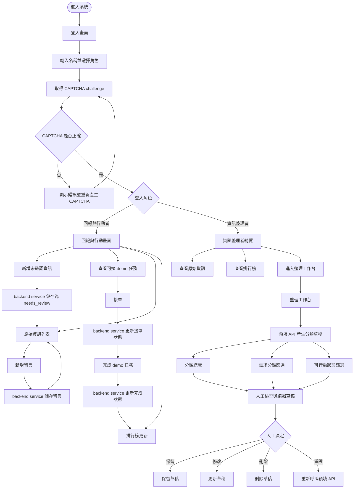

# 資訊流程設計

本文件描述災害資訊整理工作台 v1 的發行版流程。目標是讓團隊能確認使用者進入、資料新增、留言、接單、分類草稿與排行榜之間的關係，同時保留「未確認資訊不能直接變成真實行動」的安全邊界。

## v1 方向

- 主要使用者：資訊整理者。
- 次要使用者：整合後的回報與行動者。
- 核心任務：把未確認線索集中在同一平台，讓使用者能查看原始資訊、補充留言、進行 demo 接單，並讓整理者用預填草稿和分類篩選完成初步整理。
- 主要風險：使用者可能把未確認資訊、預填 API 草稿、demo 接單或排行榜誤解成真實救災派工與現場狀態。

## 流程摘要

使用者進入系統後，先在登入畫面輸入名稱、選擇角色，並完成 CAPTCHA 驗證。CAPTCHA 由本地 backend service 建立 challenge 並驗證答案；驗證失敗時重新產生 CAPTCHA，驗證成功後直接進入對應角色工作區。

回報與行動者可以新增未確認資訊、查看原始資訊、留言、接 demo 任務、完成 demo 任務，並查看排行榜。所有新增資訊都會被存成 `needs_review`，接單與完成只代表 demo 操作狀態，不代表真實派工、可以出發或現場問題已解決。

資訊整理者可以查看整理總覽、原始資訊與排行榜，並進入整理工作台。整理工作台會透過預填 API 產生分類草稿，整理者再用分類總覽、需求分類篩選與可行動狀態篩選掃描資料。預填結果只能作為可編輯草稿，不能自動升級為已確認資訊。

## 主流程圖

## 資料與狀態

| 資料 / 狀態       | 建立來源             | 誰可以操作       | 發行版限制                         |
| ----------------- | -------------------- | ---------------- | ---------------------------------- |
| CAPTCHA challenge | backend service      | 登入使用者       | demo 顯示答案，不代表正式安全機制  |
| 原始資訊          | fixture / 使用者新增 | 兩種角色皆可查看 | 新增資料一律是 `needs_review`      |
| 留言              | 使用者補充           | 兩種角色皆可新增 | 留言只是補充，不代表可信度提升     |
| demo 任務接單狀態 | 回報與行動者操作     | 回報與行動者     | 接單不是正式派工                   |
| demo 任務完成狀態 | 回報與行動者操作     | 回報與行動者     | 完成不是現場問題已解決             |
| 排行榜            | 完成狀態統計         | 兩種角色皆可查看 | 完成數不是品質、能力或安全表現評分 |
| API 預填分類草稿  | 預填 API             | 資訊整理者       | 草稿不可自動升級成已確認資訊       |
| 可行動狀態篩選    | 草稿欄位             | 資訊整理者       | 只能輔助掃描，不能自動決定真實行動 |

## 人工確認點

- 原始資訊是否足夠形成分類草稿。
- API 預填分類是否符合原文證據。
- 可行動狀態是否只能保留為「不能直接行動」或「待人工確認」。
- 留言是補充資訊、疑問，還是另一筆新的未確認線索。
- demo 任務完成是否只是操作狀態，不能被解讀為現場問題已解決。

## 不可自動處理

- 不可自動把原始資訊升級成已確認資訊。
- 不可自動判斷使用者可以真實出發或派工。
- 不可自動決定衝突來源中哪一個版本可信。
- 不可自動把完成 demo 任務解讀成現場需求已解決。
- 不可用排行榜完成數評價使用者能力、任務品質或救災優先順序。

## 操作紀錄

發行版需要保留或可追溯下列操作：

- CAPTCHA 驗證成功或失敗。
- 新增未確認資訊。
- 新增留言。
- 接單與完成 demo 任務。
- 預填 API 產生草稿的時間。
- 人工修改、刪除或重設分類草稿。

## 設計檢查結果

- 原本：登入流程較長，使用者需要通過多個登入步驟。
- 修正後：依最新需求，只保留 CAPTCHA，成功後直接進入角色工作區。
- 原因：目前 demo 需要降低登入阻力，同時保留基本防機器登入流程展示。

- 原本：流程圖只有角色操作，沒有明確資料狀態限制。
- 修正後：加入資料與狀態表，標示每一種資料的來源、操作者與發行版限制。
- 原因：可降低使用者把 demo 狀態誤解成真實派工或已確認資訊的風險。

## 後續待驗證

- demo 接單是否應只顯示已人工確認的資料。
- 回報與行動者是否需要拆成「我要回報」與「我要接單」兩種模式。
- 排行榜是否應加入品質或安全指標，避免只鼓勵完成數。
- CAPTCHA 是否要在下一版接正式 provider，或保留課堂 demo 形式。
- backend service 是否需要升級成真正 API server 與資料庫。
